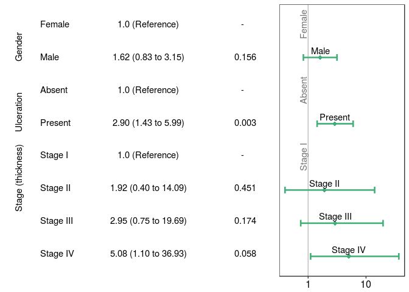
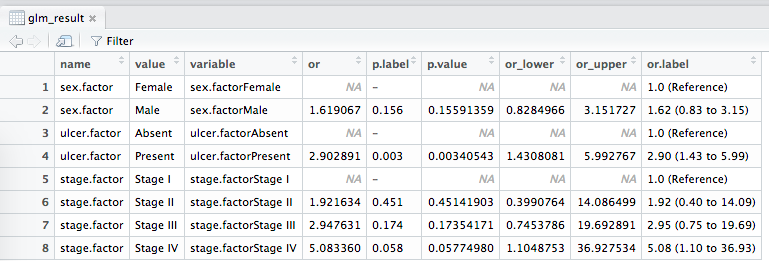
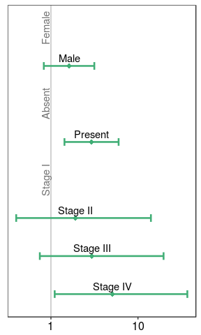
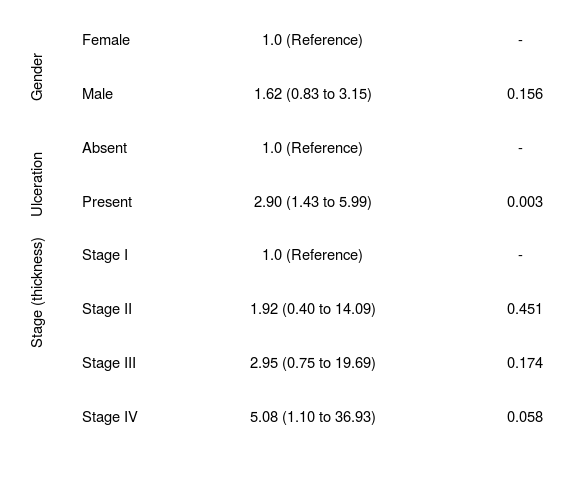

<!-- README.md is generated from README.Rmd. Please edit that file -->
tidyforest
==========

`tidyforest` contains a [tidyverse](http://tidyverse.org/) workflow for running and presenting a logistic regression model in R. This is organised into 5 functions:

-   `melanoma_formatting()` - renaming/creating factor levels. This formats the `boot::melanoma` dataset which can then be used as example input for the following functions.
-   `glm_tidyresult()` - running a logistic regression model and formatting the output into a nice dataframe (glm - generalized linear models).
-   `or_plot()` - creates a forest plot (or - odds ratios).
-   `or_table_plot()` - creates a graphical table aligned exactly to the forest plot.
-   `tidyforest()` - combines all of the above, and puts `or_plot()` and `or_table_plot` side by side.

Install
=======

`install.packages("devtools")`

and

`devtools::install_github("riinuots/tidyforest")`

Use
===

``` r
library(tidyforest)

mydata = data_melanoma()
dependent = 'status.factor' 
explanatory = c('sex.factor', 'ulcer.factor', 'stage.factor')
explanatory_names = c('Gender', 'Ulceration', 'Stage (thickness)')

tidyforest(mydata, dependent, explanatory, explanatory_names)
```



Note that outcome variable ("dependent") actually includes 3 levels: "Alive", "Died", and "Died of other causes". This example lumps the latter categories into once which might not be desired. You should always plot your data in an exploratory way (e.g. boxplots, barplots) before running advanced statistical models on it.

These warnings:

    Warning messages:
    1: Removed 21 rows containing missing values (geom_text). 
    2: Removed 3 rows containing missing values (geom_errorbar). 
    3: Removed 3 rows containing missing values (geom_point). 
    4: Removed 3 rows containing missing values (geom_text). 

can safely be ignored, as they refer to the fact that the reference levels do not have a point and an errorbar (does not make sense), or that the explanatory\_names are only printed once for the whole group (not on each line).

Or call the functions separetely
--------------------------------

``` r
library(tidyforest)

mydata = data_melanoma()

mydata %>% str() #prints the structure and first few observations
#> 'data.frame':    205 obs. of  13 variables:
#>  $ time         : num  10 30 35 99 185 204 210 232 232 279 ...
#>  $ status       : num  3 3 2 3 1 1 1 3 1 1 ...
#>  $ sex          : num  1 1 1 0 1 1 1 0 1 0 ...
#>  $ age          : num  76 56 41 71 52 28 77 60 49 68 ...
#>  $ year         : num  1972 1968 1977 1968 1965 ...
#>  $ thickness    : num  6.76 0.65 1.34 2.9 12.08 ...
#>  $ ulcer        : num  1 0 0 0 1 1 1 1 1 1 ...
#>  $ status.factor: Factor w/ 3 levels "Alive","Died",..: 3 3 1 3 2 2 2 3 2 2 ...
#>  $ sex.factor   : Factor w/ 2 levels "Female","Male": 2 2 2 1 2 2 2 1 2 1 ...
#>  $ ulcer.factor : Factor w/ 2 levels "Absent","Present": 2 1 1 1 2 2 2 2 2 2 ...
#>  $ age.factor   : Factor w/ 3 levels "[4,40]","(40,60]",..: 3 2 2 3 2 1 3 2 2 3 ...
#>  $ stage        : Factor w/ 4 levels "[0,0.5]","(0.5,1]",..: 4 2 3 3 4 4 4 3 4 4 ...
#>  $ stage.factor : Factor w/ 4 levels "Stage I","Stage II",..: 4 2 3 3 4 4 4 3 4 4 ...
```

``` r

dependent = 'status.factor'
explanatory = c('sex.factor', 'ulcer.factor', 'stage.factor')
explanatory_names = c('Gender', 'Ulceration', 'Stage (thickness)') #this is optional
   
glm_result = glm_tidyresult(mydata, dependent, explanatory)
```



``` r

or_plot(glm_result)
```



``` r

or_table_plot(glm_result, explanatory_names)
```


